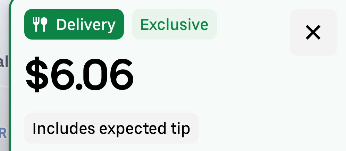
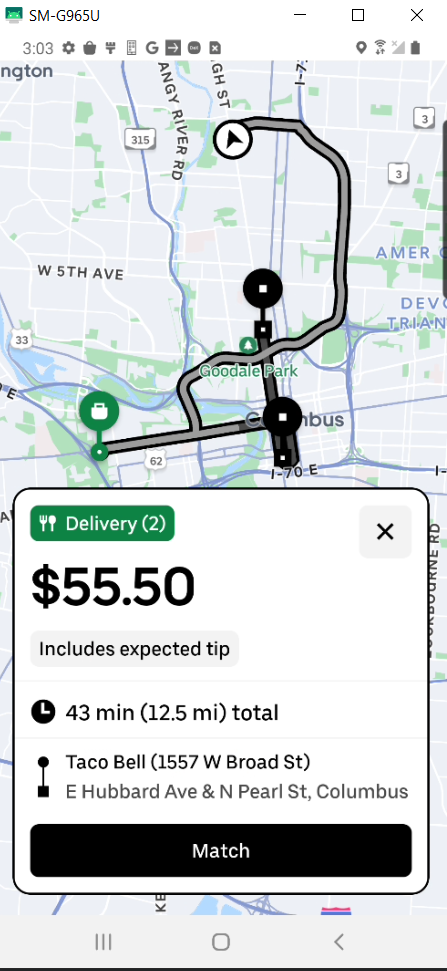

# Uber Offer Auto-Responder for Android

This project automates the process of accepting or declining Uber offers on an Android device based on a user-defined minimum payout amount. It's designed to assist gig workers by saving time and reducing screen interaction.

## 📱 Overview

The tool works by:
1. Connecting a PC to an Android device.
2. Periodically capturing screenshots.
3. Analyzing the screenshots for specific payout values.
4. Automatically tapping "Accept" or "Decline" based on user-defined criteria.

---

## 🔌 Step 1: Connect PC to Android

To begin, connect your Android device to your PC via USB and set up ADB (Android Debug Bridge). This allows your PC to control the phone screen and take screenshots.

📺 **Watch this tutorial for setup instructions**:  
[ADB Setup Video](https://www.youtube.com/watch?v=2jmO218MxXs&list=LL&index=1&ab_channel=NETVN82)

---

## 🖼 Step 2: Capture Screenshots

At regular intervals, the script will capture your Android screen.  
Example screenshot:  


---

## 🔍 Step 3: Detect Offer Amount

The script processes the screenshot using OCR (Optical Character Recognition) to detect the dollar amount in Uber offers.

---

## ✅ Step 4: Accept or Decline Offers

The detected amount is compared to a user-defined threshold. If it meets or exceeds the threshold, the offer is accepted. Otherwise, it is declined.

Example UI detection:  


---

## ⚙️ Requirements

- Python 3.x  
- ADB installed and accessible via terminal  
- `opencv-python` and `pytesseract` for image processing  
- Android device with USB debugging enabled  

---

## 🛠 Setup Instructions

```bash
pip install opencv-python pytesseract
```

Ensure ADB is set up and your phone is connected:
```bash
adb devices
```

---

## 📝 Configuration

You can configure:
- Screenshot interval
- Minimum payout threshold
- Screen coordinates for tapping "Accept" or "Decline"

---
📹 **Demo Video**:  
[v.mp4](v.mp4)

---

## ⚠️ Disclaimer

This project is provided for educational and automation purposes. Use at your own risk and ensure compliance with Uber's terms of service.
